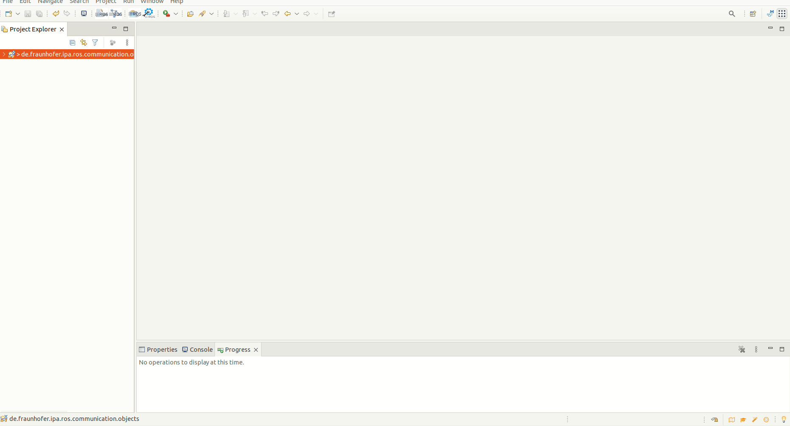
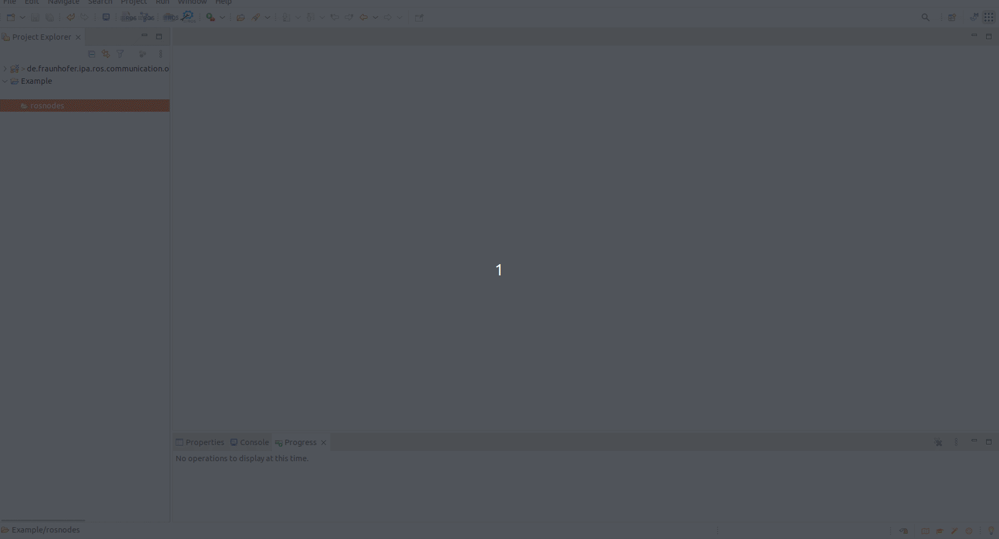
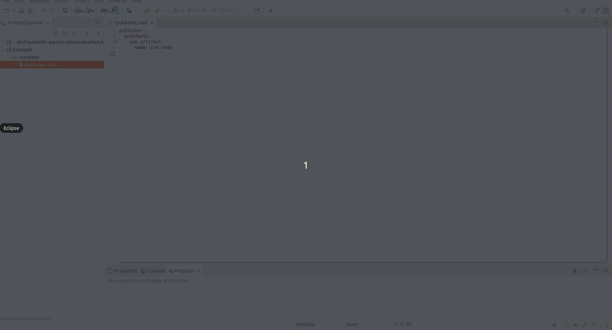
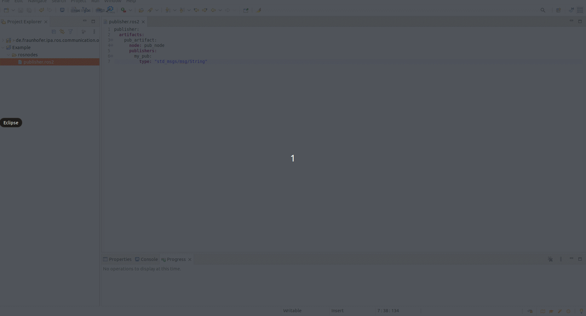
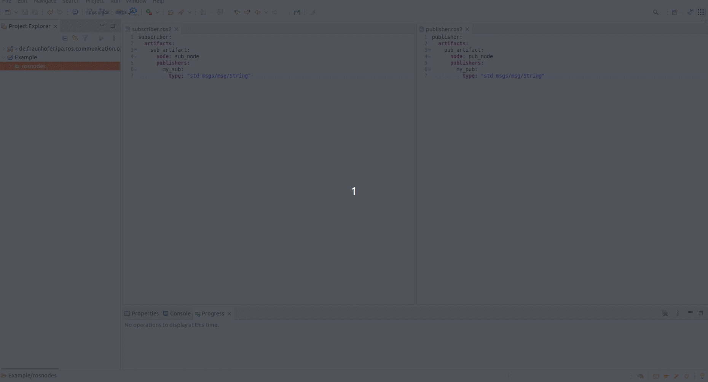
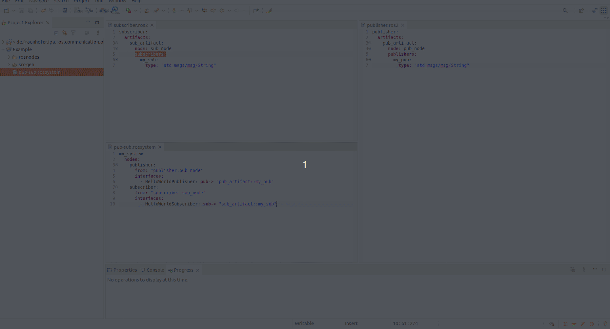

Tutorial: How to create a simple Publisher-Subscriber example
=============================================================

In this tutorial, we demonstrate how the models can be used to define ROS nodes. We will define two simple nodes: one that acts as a publisher of a "Hello World!" message and another that receives it as a subscriber.

This tutorial is fictitious and not based on any existing ROS node. The ROS example is reflected in the models of the example `pub_sub_ros2 <https://github.com/ipa-nhg/ros-model-examples/tree/main/pub_sub_ros2>`_.

The first step is to create a project to hold the models.

To import this as a project in the RosTooling, create a new modeling project by selecting **File -> New -> Project -> General -> Project**. Then, give the project a name (e.g., "Example"), press next, and add "de.fraunhofer.ipa.ros.communication.objects" as a project reference. We recommend creating a folder called "rosnodes" within the project.

Once the project is created, you can create a new file by selecting **File -> New -> Other -> File**. The file should be created under the "rosnodes" folder and must have the extension `.ros2` (e.g., **publisher.ros2**). By creating a file with the `.ros2` extension, Eclipse will convert the project to an Xtext project. Then, copy the provided content into the new file.

Following the format of the `Ros model <RosModelDescription.rst>`_, we can now create a new ROS package that contains a node with a publisher.

The first line of the model must contain the name of the package. As part of the model's grammar, a colon `:` will close the name definition line:

.. code-block:: yaml

    publisher_package:

Next, we need the artifact, a runnable to execute the node. As in every YAML format file, we must add indentation to the second line. Then, by pressing **Ctrl + Space**, the menu will suggest the text "artifacts:". We select it and proceed to the next line.

On the third line, we add double indentation and create an object under artifacts. The next object will be a name for the artifact, for example, "pub_artifact":

.. code-block:: yaml

    publisher:
      artifacts:
        pub_artifact:

Similarly, we create a node with the grammar `node: **NODENAME**`:

.. code-block:: yaml

    publisher:
      artifacts:
        pub_artifact:
          node: pub_node

Now that we have the node, we can define the interfaces that offer this node as inputs and outputs to connect to it. In our case, we want to create a publisher, which is of type **String**.

The models will look like this:

.. code-block:: yaml

    publisher:
      artifacts:
        pub_artifact:
          node: pub_node
          publishers:
            my_pub:
              type: "std_msgs/msg/String"

In the same way, we can create a subscriber:

The subscriber model will look like this:

.. code-block:: yaml

    subscriber:
      artifacts:
        sub_artifact:
          node: sub_node
          subscribers:
            my_sub:
              type: "std_msgs/msg/String"

Now that we have the components, we can compose them. For that, we need to create a new `.rossystem` file. Again, go to **File -> New -> Other -> File**. The new file must have the `.rossystem` extension.

In the `RosSystem description <RosSystemModelDescription.rst>`_, we explain the format of a system, and the editor will assist you in writing the model correctly.

First, a name must be provided followed by a colon `:`. Then, add indentation, and press **Ctrl + Space** for help. Next, define the nodes that compose the system. Under "from", we link our previously created nodes using the grammar **PackageName.NodeName**.

So far, our file looks like this:

.. code-block:: yaml

    my_system:
      nodes:
        publisher:
          from: "publisher.pub_node"
        subscriber:
          from: "subscriber.sub_node"

Next, we expose the ports to be connected. To do this, define the interfaces under the nodes, using the grammar **NodeName::InterfaceName**.

.. image:: images/pubsub_tutorial6.gif
   :alt: Expose ports

The model is updated to:

.. code-block:: yaml

    my_system:
      nodes:
        publisher:
          from: "publisher.pub_node"
          interfaces:
            - HelloWorldPublisher: pub-> "pub_artifact::my_pub"
        subscriber:
          from: "subscriber.sub_node"
          interfaces:
            - HelloWorldSubscriber: sub-> "sub_artifact::my_sub"

The last step is to create a connection between the two components. We use the `connections` description under the system description. Connections must be made between interface instances described within the models, otherwise, the model validator will generate an error.

The final model looks like this:

.. code-block:: yaml

    my_system:
      nodes:
        publisher:
          from: "publisher.pub_node"
          interfaces:
            - HelloWorldPublisher: pub-> "pub_artifact::my_pub"
        subscriber:
          from: "subscriber.sub_node"
          interfaces:
            - HelloWorldSubscriber: sub-> "sub_artifact::my_sub"
      connections:
        - [ HelloWorldPublisher, HelloWorldSubscriber ]

With this basic example, we hope you have understood how the models can be used and what kind of attributes they can represent.
