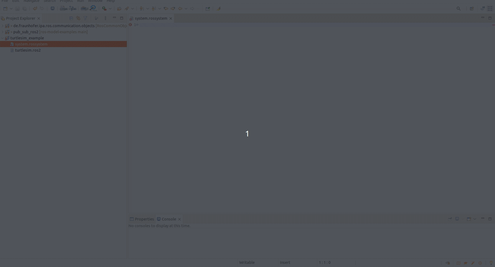
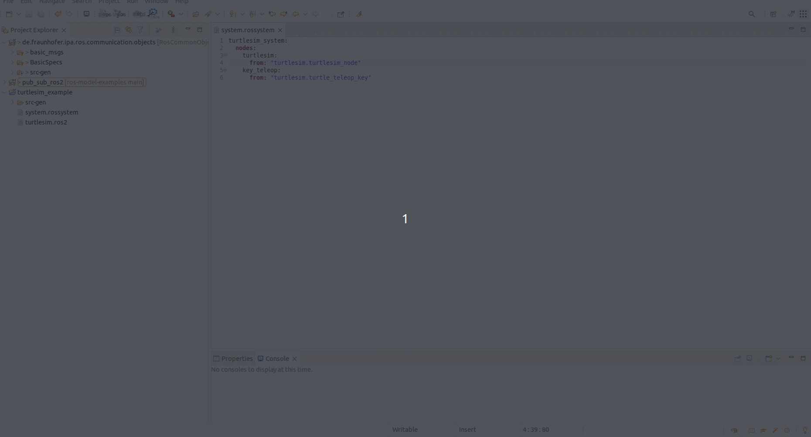
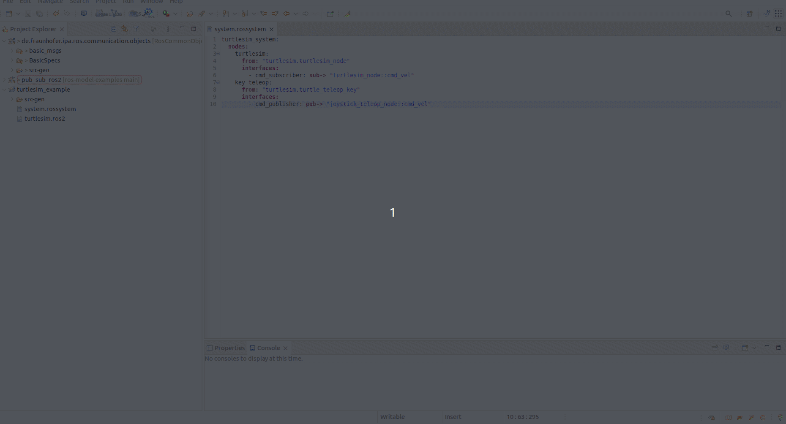
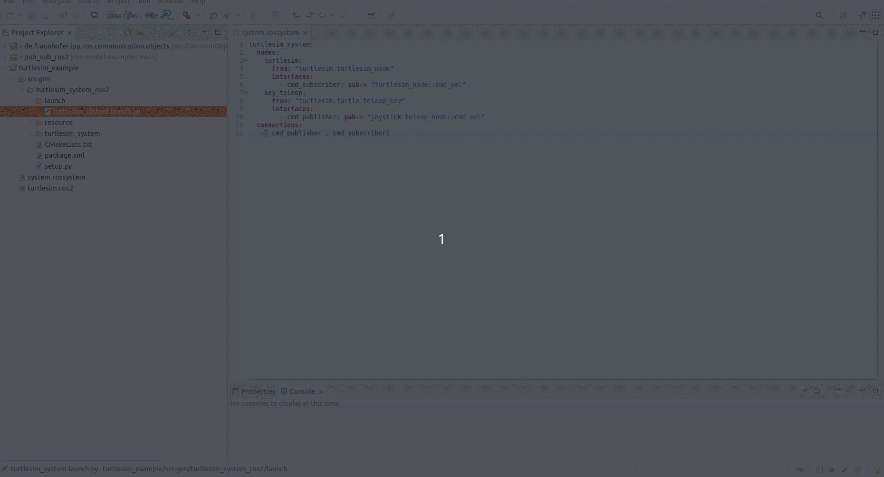

Hands-on example for the Turtlesim node 
================================================================

To learn ROS, one of the first tutorials everyone does is Turtlesim. It is a small graphical interface where a turtle can be moved using the speed commands of any robotic base in ROS. `Official TurtleSim tutorial <https://docs.ros.org/en/foxy/Tutorials/Beginner-CLI-Tools/Introducing-Turtlesim/Introducing-Turtlesim.html>`_

We will use it as an example to show the models. Let's imagine that we want to create a system in which we have two nodes, one of them is the Turtlesim and the other is a node to teleoperate it.
The first step is to create the models for both components. Both nodes are implemented in the `turtlesim <https://github.com/ros/ros_tutorials/tree/humble/turtlesim>`_ package in the `ros_tutorials <https://github.com/ros/ros_tutorials/tree/humble>`_ repository.

We can create the component models manually or use our static code `analysis tools <https://github.com/ipa320/ros-model-extractors>`_ to get them automatically. Using the second method, we obtained the following models:

.. code-block:: yaml

    turtlesim:
      fromGitRepo: "https://github.com/ros/ros_tutorials/"
      artifacts:
        turtle_teleop_key:
            node: turtle_teleop_key
            publishers:
              cmd_vel:
                type: "geometry_msgs/msg/Twist"
            parameters:
              scale_angular:
                type: Double
                default: 2.0
              scale_linear:
                type: Double
                default: 2.0
        turtlesim_node:
          node: turtlesim_node
          publishers:
            color_sensor:
              type: "turtlesim/msg/Color"
            pose:
              type: "turtlesim/msg/Pose"
          subscribers:
            cmd_vel:
              type: "geometry_msgs/msg/Twist"
          serviceservers:
            teleport_absolute:
              type: "turtlesim/srv/TeleportAbsolute"
            spawn:
              type: 'turtlesim/srv/Spawn'
            set_pen:
              type: 'turtlesim/srv/SetPen'
            reset:
              type: "std_srvs/srv/Empty"
            kill:
              type: 'turtlesim/srv/Kill'
            teleport_relative:
              type: 'turtlesim/srv/TeleportRelative'
            clear:
              type: 'std_srvs/srv/Empty'

To import this as a project in the RosTooling, create a new modeling project by pressing the icon "Add new ROS Project".

.. image:: images/create_new_RosProject.png
   :alt: Add new ROS Project

If the button doesn't work, you can also create it manually using the Eclipse menu **File -> New -> Other...** and searching for "Ros Model Project".

.. image:: images/first_project_tutorial.gif
   :alt: First project tutorial

By default, a new project with a reference to the content of "de.fraunhofer.ipa.ros.communication.objects" will be created. This new project contains a folder called "rosnodes" to hold the node descriptions and a file with the `.ros2` extension, which will have an error because it is empty. This file can be removed for this example.

Once the project is created, you can create a new file by selecting **File -> New -> Other -> File**. We recommend giving the file the same name as the package, with the extension `.ros2`. This means the new file should be called **turtlesim.ros2**. By creating a file of type `.ros2`, Eclipse will convert the project to an Xtext project. Then copy the model content from above into the new file.

Now that we have the components, we can compose them. To do this, we need to create a new `.rossystem` file. Again, go to **File -> New -> Other -> File**. The new file must have the `.rossystem` extension.

In the `RosSystem description <RosSystemModelDescription.md>`_, we explain the format of a system, and the editor will assist you in writing the model correctly.

First, give a name followed by a colon `:`, then add indentation. You can press **Ctrl + Space** for help. 
Firstly, we will add the two nodes that compose our system.

So far, our file looks like this:

.. code-block:: yaml

    turtlesim_system:
      nodes:
        turtlesim:
          from: "turtlesim.turtlesim_node"
        key_teleop:
          from: "turtlesim.turtle_teleop_key"

The "from" attributes reference the previously defined nodes in the **turtlesim.ros2** file. If you change the node names, the references must also be updated.

Next, we want to expose the ports to be connected. This means exposing the subscriber of the velocity command of the turtle and the publisher from the keyboard teleop:

The model is updated to:

.. code-block:: yaml

    turtlesim_system:
      nodes:
        turtlesim:
          from: "turtlesim.turtlesim_node"
          interfaces:
            - cmd_subscriber: sub-> "turtlesim_node::cmd_vel"
        key_teleop:
          from: "turtlesim.turtle_teleop_key"
          interfaces:
            - cmd_publisher: pub-> "turtle_teleop_key::cmd_vel"

Again, the interfaces are references to the ones already defined in the **turtlesim.ros2** file. In ROS terms, we can only instantiate topics that are described in the original ROS code (C++ or Python).

The last step is to create a connection between the two components.

The model is updated to:

.. code-block:: yaml

    turtlesim_system:
      nodes:
        turtlesim:
          from: "turtlesim.turtlesim_node"
          interfaces:
            - cmd_subscriber: sub-> "turtlesim_node::cmd_vel"
        key_teleop:
          from: "turtlesim.turtle_teleop_key"
          interfaces:
            - cmd_publisher: pub-> "turtle_teleop_key::cmd_vel"
      connections:
        - [ cmd_publisher, cmd_subscriber ]

After saving (Ctrl+S), a new folder "src-gen" will be automatically created. This folder contains a ROS 2 package ready to be executed with a launch file to start the designed system.

For a quick check, source a valid ROS installation and run the launch command to start the Turtlesim example:

.. code-block:: bash

    source /opt/ros/ROSDISTRO/setup.bash
    ros2 launch PATH_TO_LAUNCH_PY_FILE

Using the terminal of the keyboard node, you can use the arrow keys to send new commands to the turtle.

The autogenerated README file of the package will show you how to create the new workspace and run the launch file.
