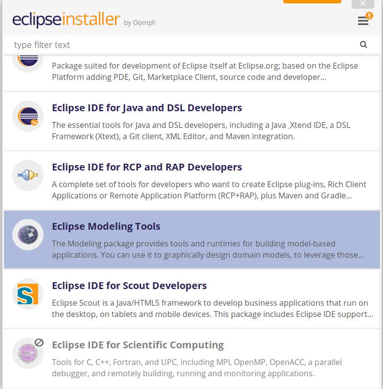

Installation and setup
======================

Option 1: Using the Release version (Recommended)
-------------------------------------------------

First, the Java environment has to be set. For Linux it can be installed with the following command:

.. code-block:: bash

   sudo apt-get install openjdk-19-jre

Then Eclipse can be installed. Please download the installer from the official Eclipse `website <https://www.eclipse.org/downloads/packages/installer>`_. 
After unpacking the downloaded file, the installer can be run by calling the command ``./eclipse-inst`` from the console.

Once you start the installer, select the package "Eclipse Modeling Tools". You can find it just by scrolling or using the search tool:

Press next, and then pick Java version 19 and the folder where you would like to install Eclipse.

.. image:: images/install_eclipse_jdk_version.png

Continue the installation, accepting the license, as usual.

Once the installation is completed, go to *Help* > *Install New Software...*. To install the latest version of the ROS tooling, add the update site URL `https://raw.githubusercontent.com/ipa320/RosTooling-update-site/main <https://raw.githubusercontent.com/ipa320/RosTooling-update-site/main>`_ in the *Work with* section.

.. image:: images/install_updatesite.png

If no package is listed, please uncheck the option *Group items by category*. The category *ROS Model* appears in the *Name* area. 
Check the box in front of *ROS model* and click *Next* to review the list of items to be installed. Click *Next* again to read and accept the terms of the license agreements, and afterward, click *Finish*. 
Eclipse will then start to install the ROS tooling and its dependencies. If you get a security warning about authenticity, click OK. 
Finally, when asked, restart Eclipse to complete the installation process.

To start using the ROS tooling continue with `step 1 <Environment_setup.rst/#1-switch-to-the-ros-developer-perspective>`_.

Alternative installations
=========================

Option 2: Using the Eclipse Installer - Source installation (ROS tooling developers)
------------------------------------------------------------------------------------

First, the Java environment has to be set:

.. code-block:: bash

   sudo apt-get install openjdk-19-jre

Download the official `Eclipse Installer <https://www.eclipse.org/downloads/packages/installer>`_ for your preferred operating system. 
Execute the installer and choose the advanced mode (menu on the right-upper corner). Select the Product *Eclipse Modeling tools* package, and then pick Java version 19.

.. image:: images/eclipse_installer1.png

Press *Next* and add a new *User project* by pressing the green button *+*:

.. code-block:: none

   Catalog: Github Projects
   Resource URIs: https://raw.githubusercontent.com/ipa320/RosTooling/main/EclipseInstaller/ROSModel.setup

Sometimes Eclipse is not able to find the file. In such cases, we recommend downloading the file locally and importing it:

.. code-block:: bash

   wget https://raw.githubusercontent.com/ipa320/RosTooling/main/EclipseInstaller/ROSModel.setup

.. image:: images/eclipse_installer2.png

Select the ROS Model project (under GitHub Projects -> <User>) and press *Next*.

By default, the ROS tooling installation will be saved under the folder *ros-model-master* in your home directory. To ensure access to the source code from GitHub, 
select the check box *Show all variables* and change the *Ros model GitHub repository* to the *HTTPs (read-write)* option. Verify that the option *Github user ID* is set to "anonymous".

.. image:: images/eclipse_installer3.png

Follow the installation instructions of the Oomph installer dialog. After the installation, Eclipse will be restarted to launch the ROS tooling configuration. 
Finally, when all the startup tasks are finished, press "Workbench."

To start using the ROS tooling continue with `step 0 <Environment_setup.rst/#0-start-the-ros-tooling-application>`_.
