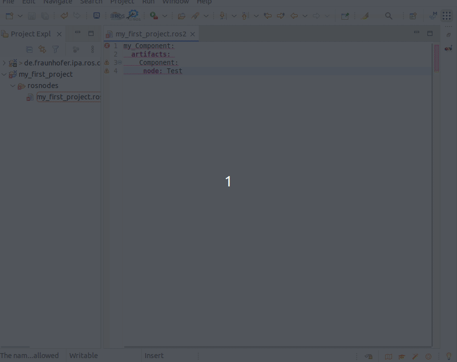
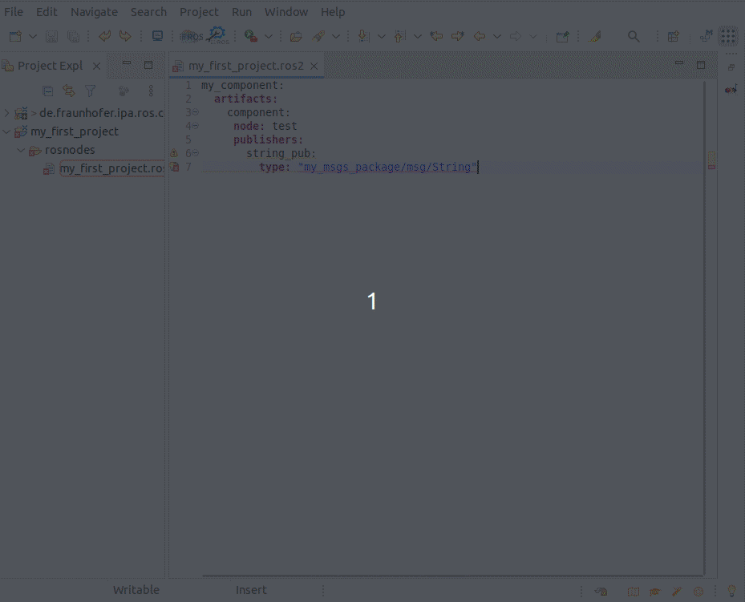
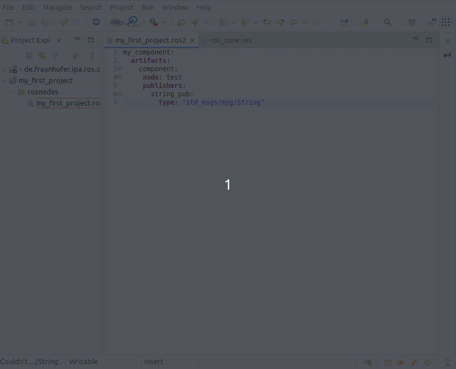
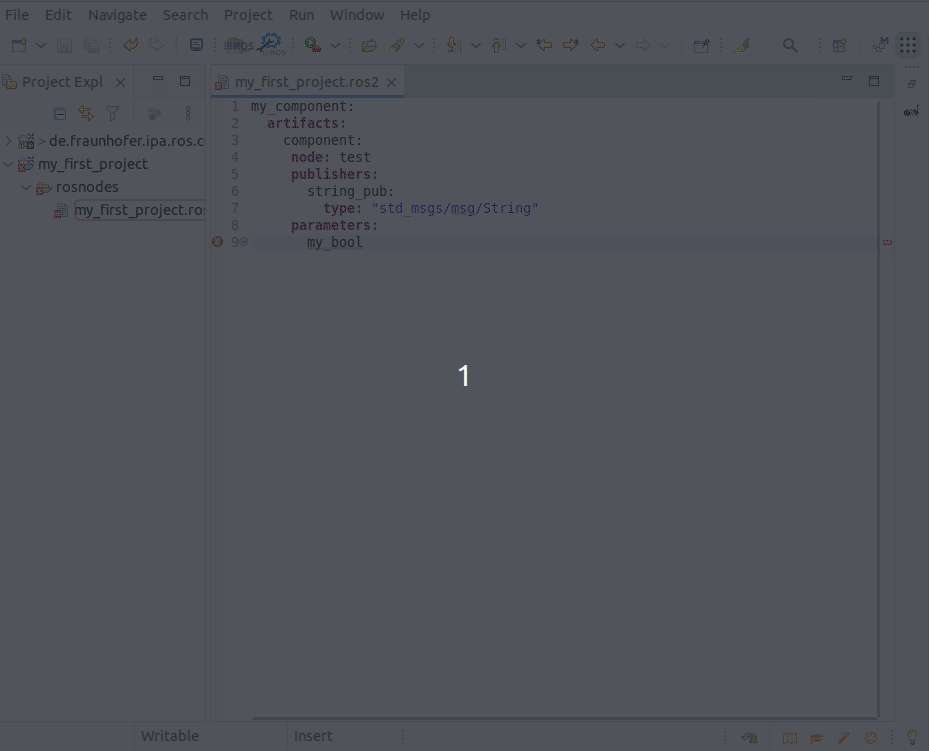

# Review models and the use of the textual editors for Ros nodes

To complete this tutorial the project "de.fraunhofer.ipa.ros.communication.objects" must be imported. See instructions under [setup](Environment_setup.md). If the automatic clone doesn't work for you, please clone the repository [RosCommonObjects](https://github.com/ipa320/RosCommonObjects) manually and import it to your Eclipse workspace.

The first step is to create a new Project to contain the examples. This can be done by pressing the icon "Add new ROS Project".


If the button doesn't work you can also create it manually using the Eclipse menu File -> New -> Other.. and searching for "Ros Model Project".


By default, a new project with a reference to the content of the "de.fraunhofer.ipa.ros.communication.objects" will be created. This new project contains a folder called "rosnodes" to hold the nodes description and a file with the extension .ros2 which will have an error because it is empty.

You can open the file and copy the following content:

```
my_Component:
  artifacts: 
    Component:
     node: Test
```

This model will report an error and two issues. By moving the mouse to the error icon, the ROS model editor will point out the issue, in this case, "The name of a package has to follow the ROS naming conventions: Capital letters are not allowed". The ROS models compiler includes the ROS naming conventions based on the [REP 144](https://ros.org/reps/rep-0144.html), where it is established that a name must "only consist of lowercase alphanumerics and _ separators and start with an alphabetic character."



Similar rules, but not mandatory, apply to the names of the artifacts and the nodes. Both issues are shown as warnings by the RosTooling.

The next case to check is the definition of a non-existent message type as a communication object for an interface. For example:

```
my_component:
  artifacts: 
    component:
     node: test
     publishers:
       string_pub:
         type: "my_msgs_package/msg/String"
```

By pasting the previous text to a .ros2 file the editor will point the following error: "Couldn't resolve reference to TopicSpec 'my_msgs_package/msg/String'." 

This means the type "my_msgs_package/msg/String" is not defined. You can easily use an existing type by removing the incorrect value a pressing Ctrl + Space bar. Then you can select for example "std_msgs/msg/String" and the error will disappear.



To review the definition of the referenced object, you should press F2 while you have the mouse pointer pointing to the object.



Last, let's check the output when a grammar error is introduced. For example by creating a parameter without a defined type. If you copy the following text to the .ros2 file:

```
my_component:
  artifacts: 
    component:
     node: test
     publishers:
       string_pub:
         type: "std_msgs/msg/String"
     parameters:
       my_bool:
```

In this case the helper will say "The required feature 'type' of 'ros.impl.ParameterImpl@37c1c0b8{platform:/resource/my_first_project/rosnodes/my_first_project.ros2#//@artifact.0/@node/@parameter.0}' must be set". 

To solve it, add a new element under my_bool to describe the type. The autocomplete function (Ctrl + Space bar) can help you to use the correct grammar.



Now that you understand how the textual editor and the model's validator work, you can check one of the extended examples. The project "de.fraunhofer.ipa.ros.communication.objects" under "BasicSpecs/Components" contains some examples. We strongly recommend taking a look at "ros_component_template.ros2".

Also, [clone and check the Catalog](Environment_setup.md#3-import-the-catalog) with many real examples of ROS components.