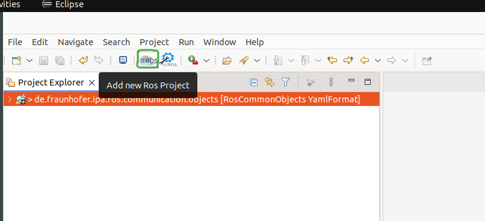
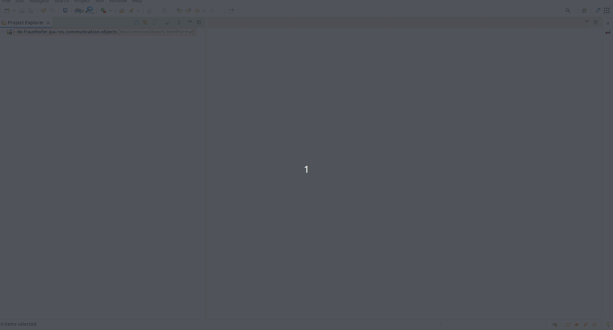
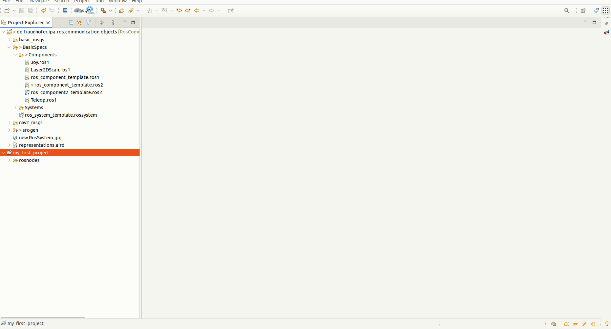
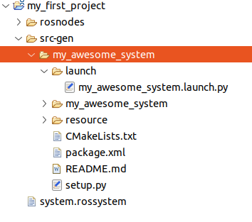
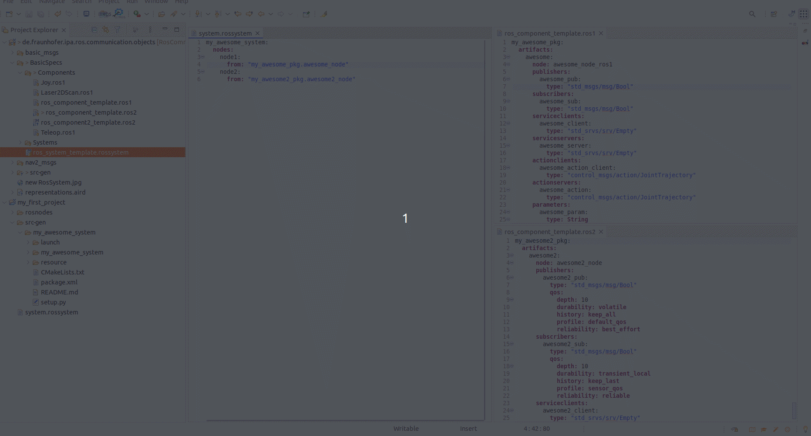
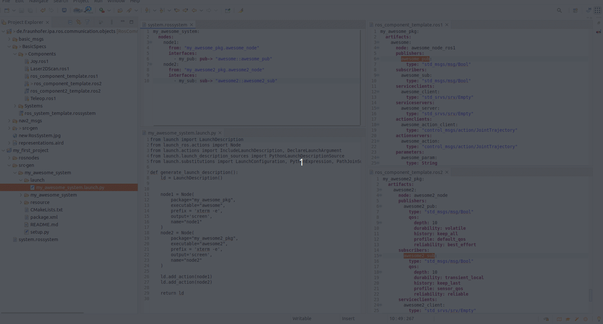
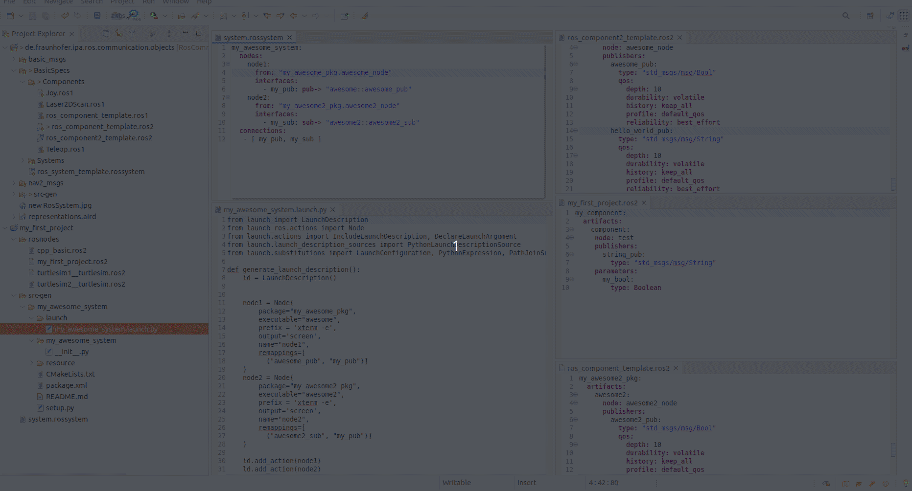
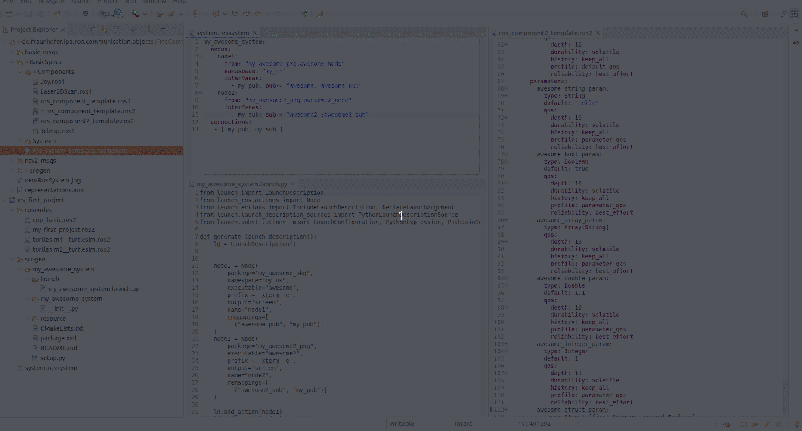

Review models and the use of the textual editors for Ros Systems
================================================================

To complete this tutorial, the project "de.fraunhofer.ipa.ros.communication.objects" must be imported. See instructions under `setup <Environment_setup.rst>`_. If the automatic clone doesn't work for you, please clone the repository `RosCommonObjects <https://github.com/ipa320/RosCommonObjects>`_ manually and import it to your Eclipse workspace.

The first step is to create a new project to contain the examples. If you completed the previous `tutorials <LearnRosModels.rst>`_, you can use the same package. Otherwise, you can create a new project by pressing the "Add new ROS Project" icon.

If the button doesn't work, you can also create it manually using the Eclipse menu **File -> New -> Other...** and searching for "Ros Model Project."

By default, a new project with a reference to the content of the "de.fraunhofer.ipa.ros.communication.objects" will be created. This new project contains a folder called "rosnodes" to hold the nodes description and a file with the extension `.ros2`, which will have an error because it is empty. The "rosnodes" folder can be removed for this example.

As system creation requires component models, you can use existing `.ros2` files for the composition. Under "de.fraunhofer.ipa.ros.communication.objects/BasicSpecs/Components", you can find the **ros_component_template.ros2** and **ros_component2_template.ros2** files. Both represent fictitious nodes with all possible interfaces and parameters. Please open both files and take a look at them.

Now we have to create a file to contain our system model. For that, go to **File -> New -> Other -> General -> File**. The new file must have the `.rossystem` extension.

As a reference, in the `RosSystem description <RosSystemModelDescription.rst>`_, we explain the format of a system, and the editor will support you in writing the model properly.

First, a name must be given followed by a colon `:`. On the next line, add indentation and press the keys **Ctrl + Space** for help. Then we define the nodes that compose the system. Under "from", we link the previously referenced nodes, and the grammar for the references is **PackageName.NodeName**.

So far, our file looks like this:

.. code-block:: yaml

    my_awesome_system:
      nodes:
        node1:
          from: "my_awesome_pkg.awesome_node"
        node2:
          from: "my_awesome2_pkg.awesome2_node"

This model is basically creating a system composed of two nodes. Upon saving the model, a folder "src-gen" will be created automatically. This folder contains a new ROS package whose structure corresponds to a Python launch package.

The `CMakeLists.txt` and `package.xml` list the required dependencies and tags to compile the package. Under the "launch" folder, the Python file starts both nodes. See the `Code generator review tutorial <docu/CodeGeneration.rst>`_ for further details.

Next, we want to expose the ports to be connected. For that, we define the interfaces under the nodes. Again, we must reference the created interfaces using the grammar **NodeName::InterfaceName**. Although in ROS all interfaces are automatically exposed, the RosSystem model requires this step to clearly design the system and the ports that are intentionally opened by the system architect.

.. code-block:: yaml

    my_awesome_system:
      nodes:
        node1:
          from: "my_awesome_pkg.awesome_node"
          interfaces:
            - my_pub: pub-> "awesome::awesome_pub"
        node2:
          from: "my_awesome2_pkg.awesome2_node"
          interfaces:
            - my_sub: sub-> "awesome2::awesome2_sub"

The next step is to create a connection between the two components. For that, we use the `connections` attribute under the system description. The connections must be made between interface instances described within the models; otherwise, the model validator will give an error.

Currently, our model looks like this:

.. code-block:: yaml

    my_awesome_system:
      nodes:
        node1:
          from: "my_awesome_pkg.awesome_node"
          interfaces:
            - my_pub: pub-> "awesome::awesome_pub"
        node2:
          from: "my_awesome2_pkg.awesome2_node"
          interfaces:
            - my_sub: sub-> "awesome2::awesome2_sub"
      connections:
        - [ my_pub, my_sub ]

We invite you to try different combinations and debug the validator for connections. For example:

.. code-block:: yaml

    my_awesome_system:
      nodes:
        node1:
          from: "my_awesome_pkg.awesome_node"
          interfaces:
            - my_pub: pub-> "awesome::awesome_pub"
            - string_pub: pub-> "awesome::hello_world_pub"
        node2:
          from: "my_awesome2_pkg.awesome2_node"
          interfaces:
            - my_sub: sub-> "awesome2::awesome2_sub"
      connections:
        - [string_pub, my_sub]

This file will give a compilation error, and therefore the launch file will not be generated, because you are trying to connect ports with different message types. The same will happen if we try to connect different types of ports, like a topic with a service.

Another attribute that can be set, and the generator will take into account, is the `namespace`:

Lastly, we can check the set of parameter values. A valid example of this would be:

.. code-block:: yaml

    my_awesome_system:
      nodes:
        node1:
          from: "my_awesome_pkg.awesome_node"
          namespace: "my_ns"
          interfaces:
            - my_pub: pub-> "awesome::awesome_pub"
        node2:
          from: "my_awesome2_pkg.awesome2_node"
          interfaces:
            - my_sub: sub-> "awesome2::awesome2_sub"
          parameters:
            - string_example: "awesome2::awesome2_string_param"
              value: "hello"
      connections:
        - [ my_pub, my_sub ]

Here, we assign a string value to the parameter `awesome2_string_param`. If we attempt to give a wrong value, for example:

.. code-block:: yaml

    my_awesome_system:
      nodes:
        node1:
          from: "my_awesome_pkg.awesome_node"
          namespace: "my_ns"
          interfaces:
            - my_pub: pub-> "awesome::awesome_pub"
        node2:
          from: "my_awesome2_pkg.awesome2_node"
          interfaces:
            - my_sub: sub-> "awesome2::awesome2_sub"
          parameters:
            - string_example: "awesome2::awesome2_string_param"
              value: 5
      connections:
        - [ my_pub, my_sub ]

The compiler will give a type mismatch error.

The validator has some parts that are not fully implemented. Check the `Known issues <RosTooling_issues.rst>`_ page if you encounter problems while following this tutorial.

Another feature included as part of the code generator is the generation of parameter files. This will be done automatically, and the launch file will, by default, load it when more than 5 parameters are set. For example, in this case:

.. code-block:: yaml

    my_awesome_system:
      nodes:
        node1:
          from: "my_awesome_pkg.awesome_node"
          namespace: "my_ns"
          interfaces:
            - my_pub: pub-> "awesome::awesome_pub"
        node2:
          from: "my_awesome2_pkg.awesome2_node"
          interfaces:
            - my_sub: sub-> "awesome2::awesome2_sub"
          parameters:
            - array_example: "awesome::awesome_array_param"
              value: ["hello", "hallo"]
            - bool_example: "awesome::awesome_bool_param"
              value: true
            - double_example: "awesome::awesome_double_param"
              value: 1.2
            - integer_example: "awesome::awesome_integer_param"
              value: 2
            - string_param: "awesome::awesome_string_param"
              value: "hallo"
            - struct_param: "awesome::awesome_struct_param"
              value: [
                first: 2
                second: true]
      connections:
        - [ my_pub, my_sub ]

In this case, a new file will be created under `src-gen/PackageName/config/`, containing the configuration of `node2`. The launch file will be adapted to launch the configuration from a file.

With this very basic example, we hope you have understood how the models can be used and what kind of attributes they allow you to represent.
