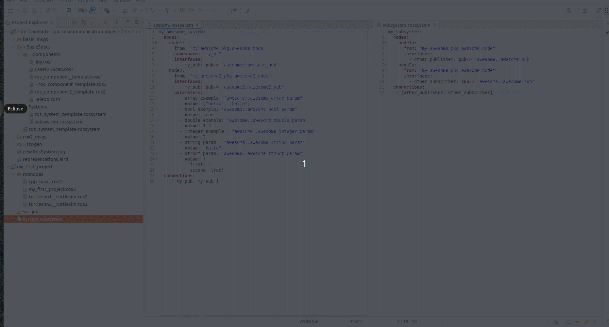
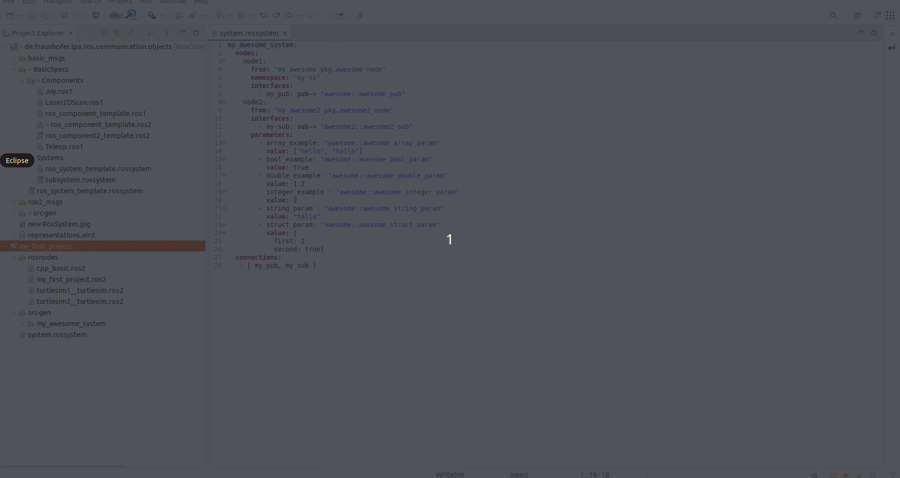

# Other ways to define a system

The [previous tutorial](LearnRosSystemModels.md) shows the description of typical systems created by composing nodes. But with the RosTooling it is also allowed the composition of subsystems. 
Again, you have the site [RosSystem description](RosSystemModelDescription.md) as reference.


## Subsystems from model

Under "de.fraunhofer.ipa.ros.communication.objects/BasicSpecs/Systems" some other examples of subsystems can be found. To compose them, imagine we have the file created within the [previous tutorial](LearnRosSystemModels.md), we can easily add the subsystems definition. 

```
my_awesome_system:
  subSystems:
    my_subsystem
  nodes:
    node1:
      from: "my_awesome_pkg.awesome_node"
      namespace: "my_ns"
      interfaces:
        - my_pub: pub-> "awesome::awesome_pub"
    node2:
      from: "my_awesome2_pkg.awesome2_node"
      interfaces:
        - my_sub: sub-> "awesome2::awesome2_sub"
      parameters:
        - array_example: "awesome::awesome_array_param"
          value: ["hello", "hallo"]
        - bool_example: "awesome::awesome_bool_param"
          value: true
        - double_example: "awesome::awesome_double_param"
          value: 1.2
        - integer_example : "awesome::awesome_integer_param"
          value: 2
        - string_param : "awesome::awesome_string_param"
          value: "hallo"
        - struct_param: "awesome::awesome_struct_param"
          value: [
            first: 2
            second: true]
  connections:
   - [ my_pub, my_sub ]
```



The code generator will update not only the launch file but also the package.xml to add the dependency to the package that contains the subsystem definition.

## Subsystems from launch files (existing ROS systems)


As the RosTooling pretends to support the ROS developers in the way they work, therefore it allows also the use of systems for whose a launch file is already available and does not re-generate or duplicate code that already exists. This is the reason for having the attribute "fromFile". 



The compiler expects the package name followed by the relative path to the file. The file must be given with the extension. An example looks like:

```
my_awesome_system:
  fromFile: "pkg_name/launch/my_file.launch.py"
  nodes:
    node1:
      from: "my_awesome_pkg.awesome_node"
      namespace: "my_ns"
      interfaces:
        - my_pub: pub-> "awesome::awesome_pub"
    node2:
      from: "my_awesome2_pkg.awesome2_node"
      interfaces:
        - my_sub: sub-> "awesome2::awesome2_sub"
      parameters:
        - array_example: "awesome::awesome_array_param"
          value: ["hello", "hallo"]
        - bool_example: "awesome::awesome_bool_param"
          value: true
        - double_example: "awesome::awesome_double_param"
          value: 1.2
        - integer_example : "awesome::awesome_integer_param"
          value: 2
        - string_param : "awesome::awesome_string_param"
          value: "hallo"
        - struct_param: "awesome::awesome_struct_param"
          value: [
            first: 2
            second: true]
  connections:
   - [ my_pub, my_sub ]
```

The code generator for these cases, will not create the launch but update the README file to give instructions about how to install and start the defined file.

It is strongly recommended to give also information about the components and interfaces within the system. This will help with the documentation and be taken into consideration for the visualization of the system.