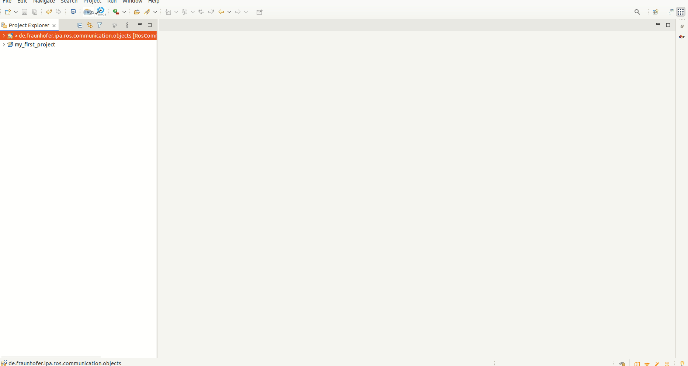
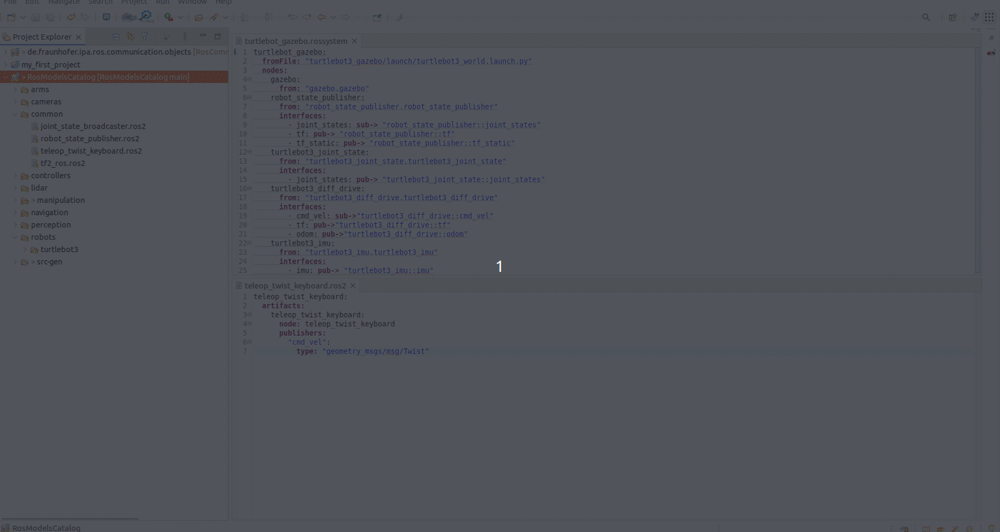
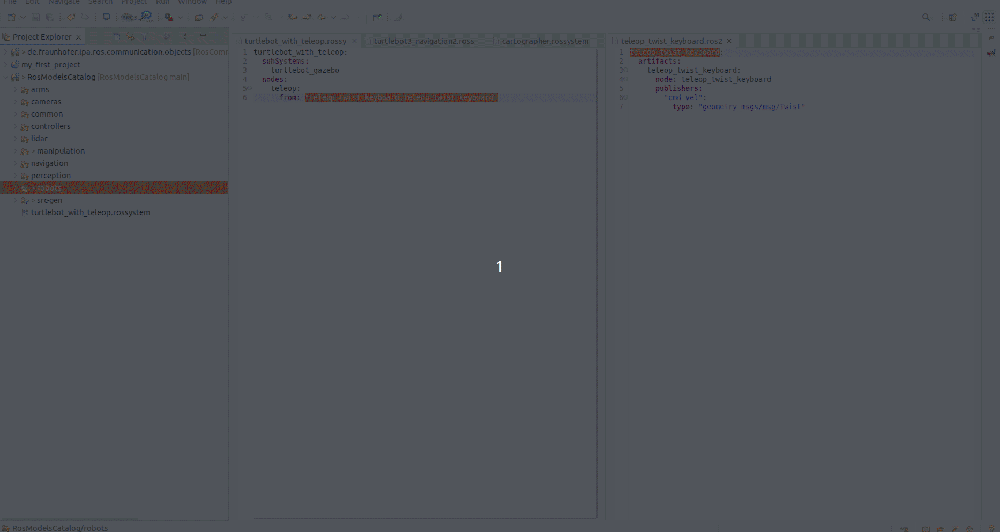
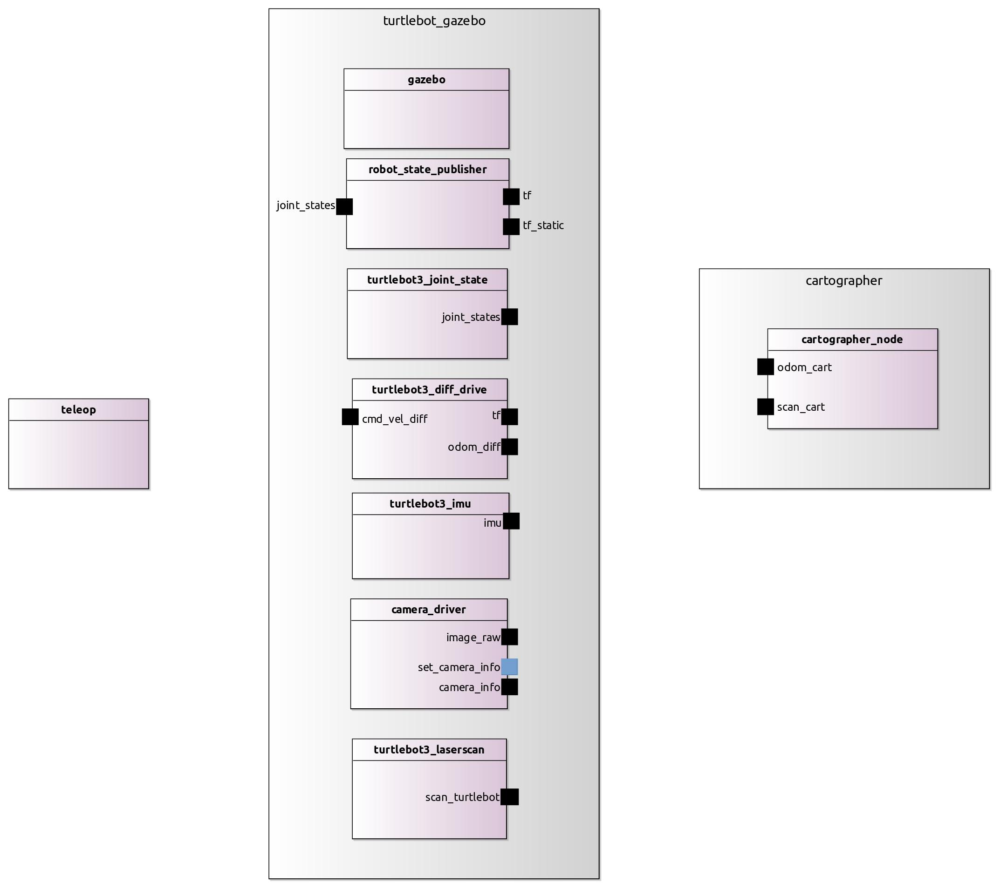
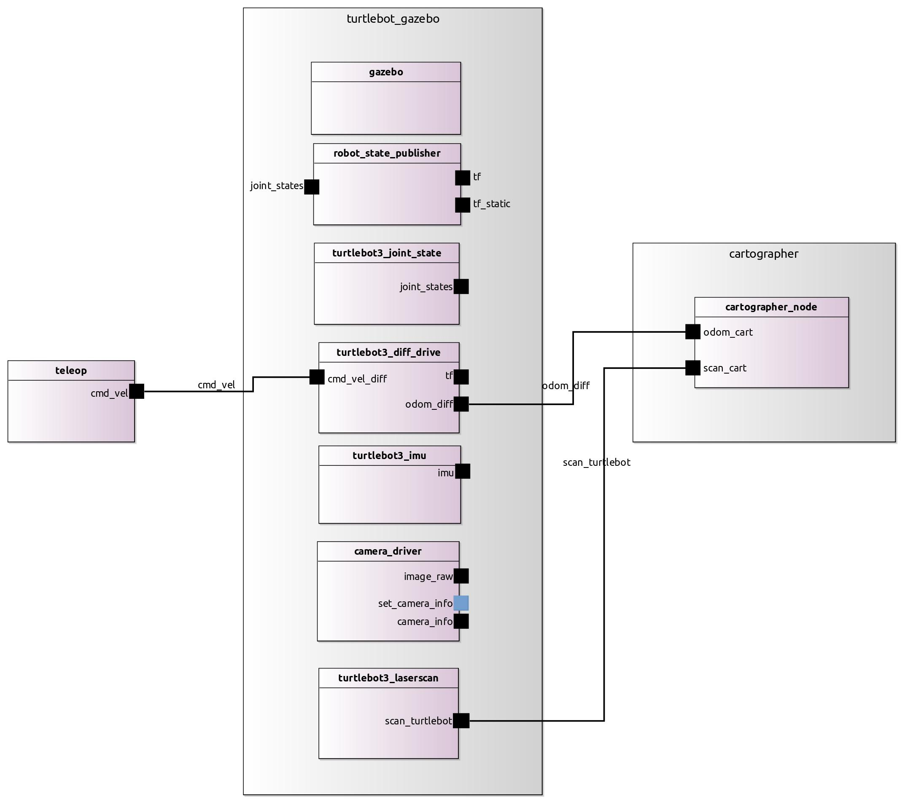

## Hands-on example using common ROS systems (beginner) []

The execution part of this tutorial will only work for people with a local ROS 2 installation.

In this tutorial, we are going to see how you can compose existing systems or add a new component to them. For this, we will use the turtlebot in simulation.

First of all, we need the turtlebot model, this and other models are available in our catalog of components and subsystems. The catalog is publicly available on GitHub [ipa-nhg/RosModelsCatalog](https://github.com/ipa-nhg/RosModelsCatalog).

Please clone the repository and import it to your Eclipse workspace. This can be easily done by File -> Import -> General -> Existing Projects into Workspace. Then select the container folder of the cloned repository.



For this tutorial, we will use the gazebo subsystem. The model is available under **RosModelsCatalog/robots/turtlebot3/simulation/turtlebot_gazebo.rossystem**. This model summarizes the set of nodes that are started in recursive including through the [launch file of the turtlebot_gazebo package](https://github.com/ROBOTIS-GIT/turtlebot3_simulations/blob/master/turtlebot3_gazebo/launch/turtlebot3_world.launch).

The proposed model looks like this:

```
turtlebot_gazebo:
  fromFile: "turtlebot3_gazebo/launch/turtlebot3_world.launch.py"
  nodes:
    gazebo:
      from: "gazebo.gazebo"
    robot_state_publisher:
      from: "robot_state_publisher.robot_state_publisher"
      interfaces:
        - joint_states: sub-> "robot_state_publisher::joint_states"
        - tf: pub-> "robot_state_publisher::tf"
        - tf_static: pub-> "robot_state_publisher::tf_static"
    turtlebot3_joint_state:
      from: "turtlebot3_joint_state.turtlebot3_joint_state"
      interfaces:
        - joint_states: pub-> "turtlebot3_joint_state::joint_states"
    turtlebot3_diff_drive:
      from: "turtlebot3_diff_drive.turtlebot3_diff_drive"
      interfaces:
        - cmd_vel: sub->"turtlebot3_diff_drive::cmd_vel"
        - tf: pub->"turtlebot3_diff_drive::tf"
        - odom: pub->"turtlebot3_diff_drive::odom"
    turtlebot3_imu:
      from: "turtlebot3_imu.turtlebot3_imu"
      interfaces:
        - imu: pub-> "turtlebot3_imu::imu"
    camera_driver:
      from: "camera_driver.camera_driver"
      interfaces:
        - camera_info: pub-> "camera_driver::camera/camera_info"
        - image_raw: pub-> "camera_driver::camera/image_raw"
        - set_camera_info: ss-> "camera_driver::set_camera_info"
    turtlebot3_laserscan:
      from: "turtlebot3_laserscan.turtlebot3_laserscan"
      interfaces:
        - scan: pub-> "turtlebot3_laserscan::scan"
```

Where the "fromFile" attribute points to the launch file that must be started to run the (sub-)system.

Then, we added the most relevant nodes and interfaces that we wanted to expose for the integration with higher-level components. In this case robot_state_publisher, turtlebot3_joint_state, turtlebot3_diff_drive, turtlebot3_imu, camera_driver, turtlebot3_laserscan. The granularity of the description and its completeness is a decision that the developer can take. For the RosTooling a file containing only the first two lines:

```
turtlebot_gazebo:
  fromFile: "turtlebot3_gazebo/launch/turtlebot3_world.launch.py"
```

is fully valid. However, for documentation and composability reasons, it is highly recommended the addition of, at least, the most prominent components and their interfaces. All of this information will be taken into account to generate the README.md file.

### Compose the turtlebot simulation with the teleop keyboard node []

As a traditional and basic case in mobile base in robotics, we can combine the simulator with the teleop node. 

The catalog repository includes also a keyboard teleop component, it can be found under **RosModelsCatalog/common/teleop_twist_keyboard.ros2**.

It basically contains one node that takes the commands from the keyboard and transforms them into velocity commands using the common ROS message **geometry_msgs/Twist**.

The new system can be easily designed by creating a [new .rossystem file](LearnRosSystemModels.md) and adding the two modules we want to compose. First the turtlebot_gazebo as subsystem:

```
turtlebot_with_teleop:
  subSystems:
    turtlebot_gazebo
```

And secondly, the teleop keyboard node:
```
turtlebot_with_teleop:
  subSystems:
    turtlebot_gazebo
  nodes:
    teleop_key:
      from: "teleop_twist_keyboard.teleop_twist_keyboard"
```



The file will be validated by the RosSystem compiler and the **turtlebot_with_teleop** package created under the src-gen folder.

The autogenerated README file explains how to install the dependencies and start the system. 
 One instruction, particularly for the turtlebot is missed, the robot name has to be set as an environment variable. This means, that before you call the launch command you have to export the following variable:

```
export TURTLEBOT3_MODEL=waffle_pi
```


Another nice feature of the RosTooling at this stage of the development, during the design phase, is that makes very easy the testing of alternative components. For example, we can use another implementation of a teleop keyboard node. The catalog contains the description of the package turtlebot_keyboard under **RosModelsCatalog/robots/turtlebot3/turtlebot3_teleop.ros2**.

By the modification of one line on the model:

```
turtlebot_with_teleop:
  subSystems:
    turtlebot_gazebo
  nodes:
    teleop:
      from: "turtlebot3_teleop.teleop_keyboard"
```



The new package will be fully auto-generated. Contain the dependency on the new implementation of the teleop node and launch it together with the simulation.

### Compose the turtlebot simulation with the cartographer node []

Similarly to the previous example, the system can be made more complex. An example of this is to add the [cartographer node](https://google-cartographer-ros.readthedocs.io/en/latest/ros_api.html) to the system.

The description of the cartographer node is available as part of the catalog, under the folder **navigation**. Also, for the specific case of the turtlebot there is an available configuration, we can basically reuse it as a subsystem with the following model:

```
turtlebot_with_teleop_and_cartographer:
  subSystems:
    turtlebot_gazebo
    cartographer
  nodes:
    teleop:
      from: "turtlebot3_teleop.teleop_keyboard"
```


Then basically, you have to follow the information in the README file. By launching the system you will be able to move the robot using the teleop and in RVIZ visualise the map. To save it, [the common ROS command can be called](https://ros2-industrial-workshop.readthedocs.io/en/latest/_source/navigation/ROS2-Cartographer.html):

```
ros2 run nav2_map_server map_saver_cli -f my_map
```

### (Optional) Extra notes, and consideration

By following the previous examples you show that the RosTooling intend to support the ROS developers in the way they usually work. However, at the same time, we aim to promote the follow-up of software quality processes aided by modeling techniques.

In the previous system, we have not needed an explicit definition of the ports to be connected. However, it has worked because ROS allows it, i.e. whenever a subscriber and a publisher have the same name and type in runtime they will connect automatically. Nevertheless, this is not seen during the design time, and therefore it is not validated by the designer. If we visualize the model we created, we will see the following diagram:



As documentation this image is incomplete, also to communicate or give the complete picture of the system to third parties or people without technical knowledge, this is insufficient. Therefore it is convenient to be as explicit as possible, for a better system design, a clean validation process and an understanding of the system before deployment, and to have better-documented software.

For example in this case it would be:
```
turtlebot_with_teleop_and_cartographer:
  subSystems:
    turtlebot_gazebo
    cartographer
  nodes:
    teleop:
      from: "turtlebot3_teleop.teleop_keyboard"
      interfaces: 
       - cmd_vel: pub-> "teleop_keyboard::cmd_vel"
  connections:
    - [cmd_vel, cmd_vel_diff]
    - [scan_turtlebot, scan_cart]
    - [odom_diff, odom_cart]
```

The corresponding visualization would be in that case:


