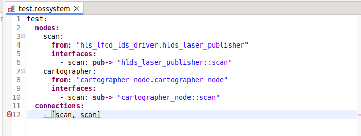
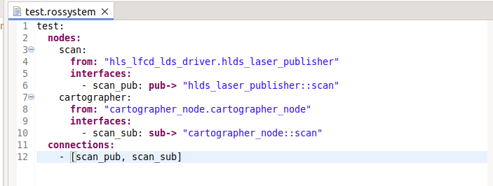

# RosTooling Known Issues

Some of the features of the RosTooling are not yet fully developed or robust enough.

## System validators

### Instantiation of interfaces from other nodes 

Right now when you create a system and add a node, the tooling allows you to add ports to that node that are not in its original definition. Any topic of any node in your workspace can be referenced. For example the following example:

The test system includes the node camera from the node "usb_cam.usbcam" (right-bottom model), but the reference interface is a scanner output from the node "hls_lfcd_lds_driver.hlds_laser_publisher". This is not giving a compilation error but it is wrong. The user of the RosTooling has to take care of defining the interfaces correctly. 

This issue will be fixed for the next release.

### Ports with the same name to form connections

For simplicity, we shorten the reference on the connections to the single name of the interfaces. However, this produces errors at the moment that both interfaces (input and output) have the same name. Like the following example:

The screenshot example is correct but the compiler couldn't distinguish if the input is the scan topic defined as publisher or as subscriber.

To solve this, the user must change the name of the instance. This can produce a remap of the topics:

This issue will be fixed for the next release.

## Code generators

The launch file generator is not taking into account:
* Connections related to subsystems, the remap of the topic will not be autogenerated
  

