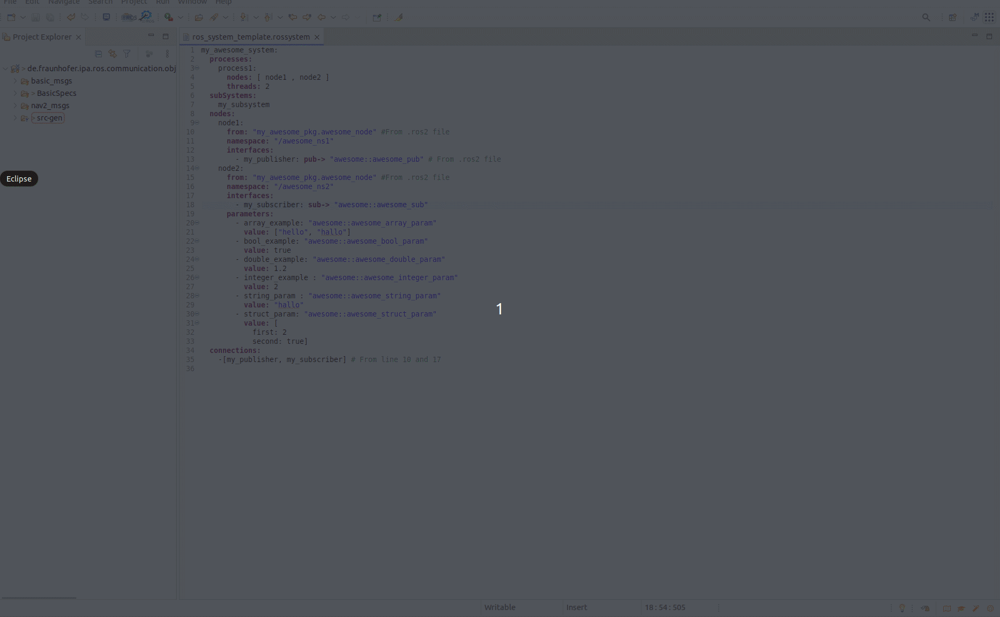
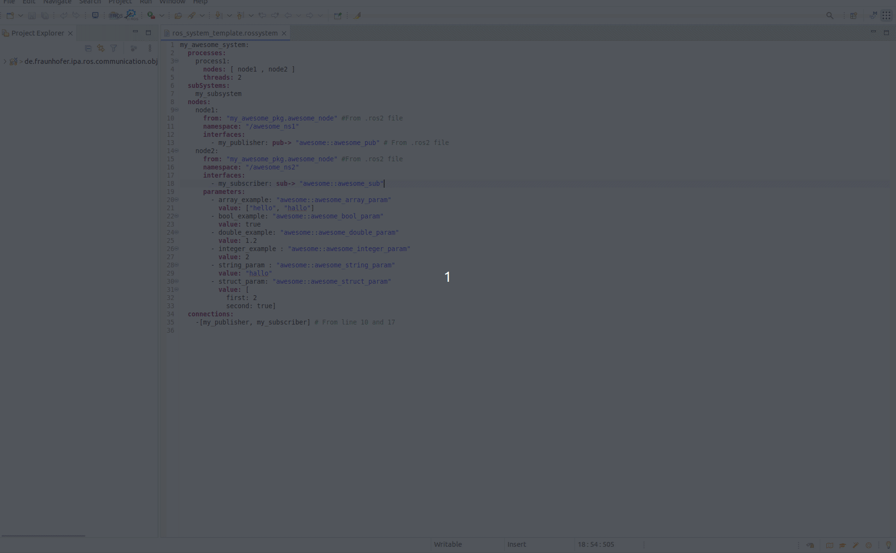
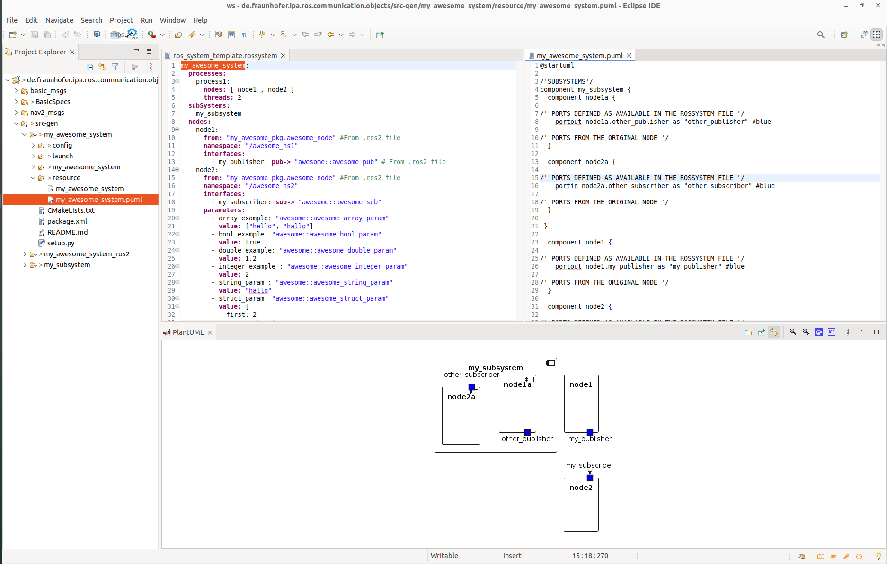
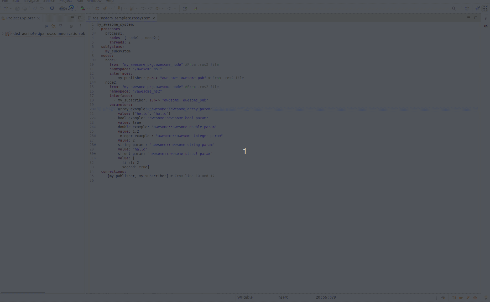
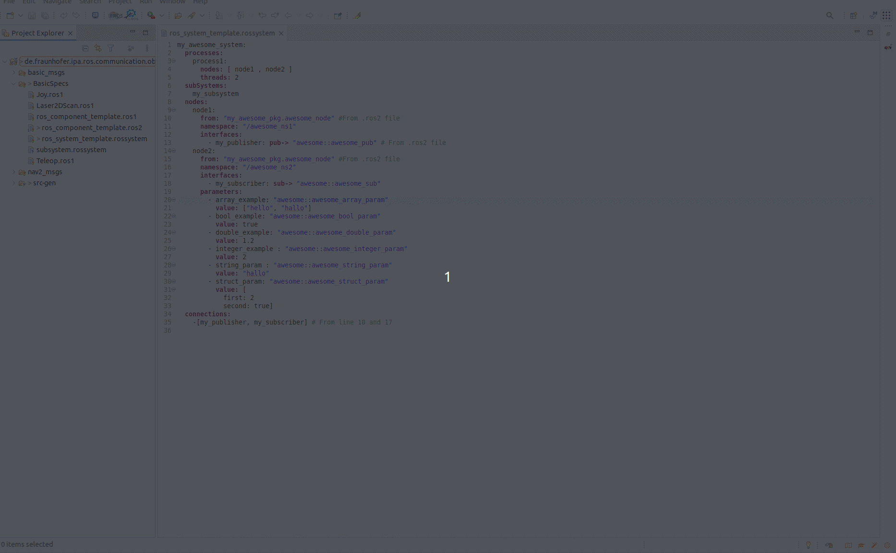
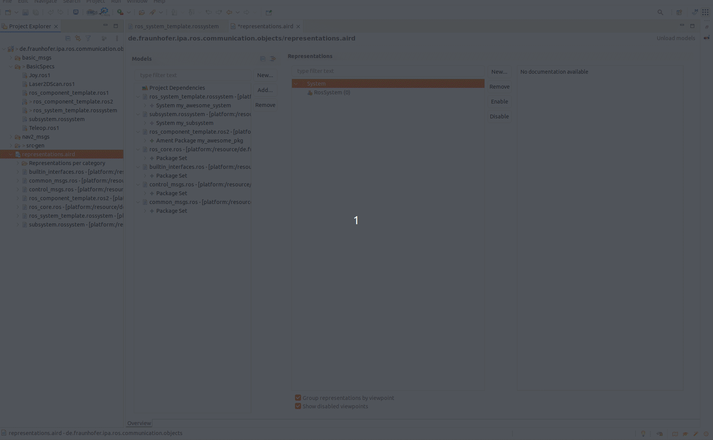
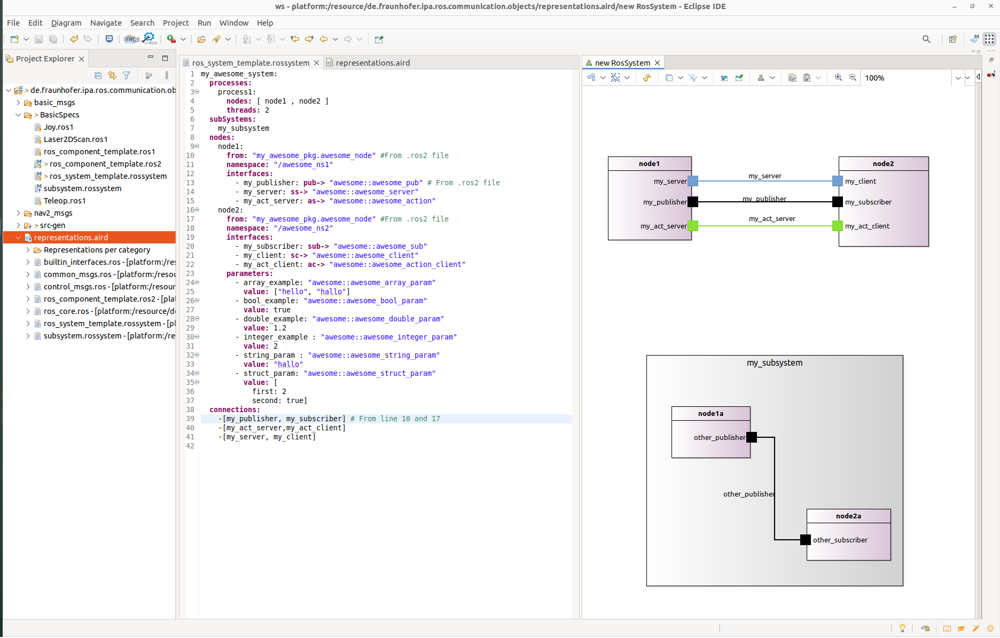
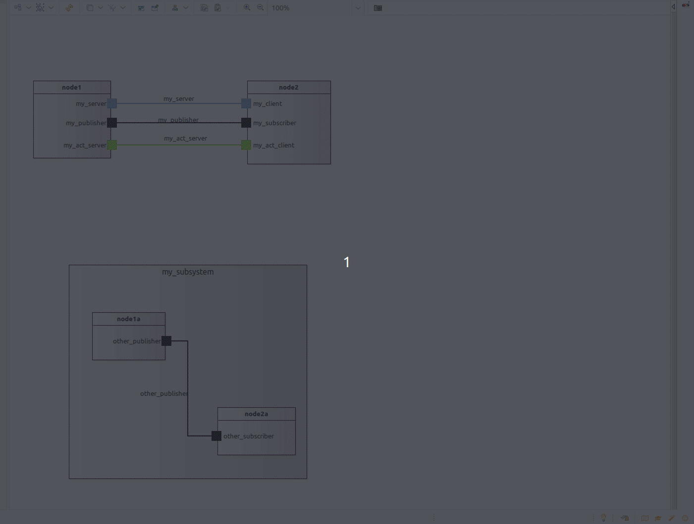

# System visualization

The RosTooling offer two visualization options:
* By the generation of [PlantUML](https://plantuml.com/) diagrams
* By using a [Sirius](https://eclipse.dev/sirius/) implementation as eclipse plugin.

## PlantUML compiler

### Embeded the viewer on the Eclipse environment

The Eclipse Marketplace includes a PlantUML plugin. To install it go in eclipse to Help -> Eclipse Marketplace..  and search for "PlantUML". Select the Plugin and let eclipse to install it.

Once the installation is completed, eclipse must be restarted.

To open the visualizer in Eclipse you can easily go to "Window"->  "Show view" -> Other and select "PlantUML".

### Open the PlantUML auto-generated description

By default the RosTooling will autocatically generate a PlantUML file description of every valid RosSystem model. 

It will be hold in the src-gen folder of the corresponding ROS package in the folder "resources". The file extension is .puml. By opening it with a text editor and having the PlantUML visualizer open the diagram will appear.

Alternativelly, you can copy the content of the generated file to an online PlantUML editor tool like [PlantText](https://www.planttext.com/).

## Sirius visualizer

### Install Sirius on eclipse

Sirius can be easily installed using the the Eclipse Marketplace. Go in eclipse to Help -> Eclipse Marketplace..  and search for "Sirius". Select the Plugin and let eclipse to install it.

Once the installation is completed, eclipse must be restarted.

### Create a representation view of your system

A representation file is a file in which Sirius stores all informations related to which representations you created, what appears on them, the positions and colors of the elements, etc. This files have a .aird extension (typically representations.aird). Representation files reference the semantic model(s) for which they contain representations, but your semantic models themselves are kept unaware (and unpolluted) of any Sirius-specific data.

To create this file you can go to File -> New -> Other and then navigate or search for "Representations File".

We recommend to select the initialization method "Initialization from a semantic resource" and use the helper to navigate and select the .rossystem file you would like to open.

While opening the representation file with a "Aird Editor", which should be the default option.

In the menu Representations (it should be the menu in the middle) choose the "RosSystem" option and press "New.." then choose the RosSystem entity of your "*.rossystem" model and press finish.

Then you can use the mouse to move and components, interfaces or labels to the desired position.

For complex systems a nice Feature of Sirius is the option to hide some elements. For that purpose you can use the tools panel or make a right click in the Representation view and select "Show/Hide". It also allows to generate a JPG image of the system view.

